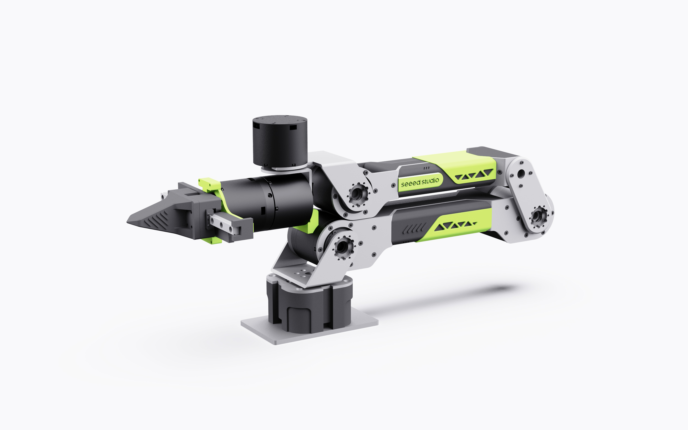

# 🦾 reBot-DevArm: 为每个开发者开源的机械臂

  

    <!-- 替换为 CC BY-NC-SA 4.0 徽章，明确标示非商用 -->
    
    
    
    
    

  <strong>100% 全开源 · 具身智能 · 软硬一体 · 个人/教育免费 · 商用需授权</strong>

  <strong>
    <a href="./README_zh.md">简体中文</a> &nbsp;|&nbsp;
    <a href="./README.md">English</a> &nbsp;|&nbsp;
    <a href="./README_JP.md">日本語</a>&nbsp;|&nbsp;
    <a href="./README_Fr.md">français</a>
  </strong>

<a href="https://wiki.seeedstudio.com/robotics_page/">  
    </a>

 👉 **[点击进入 Wiki 知识库](https://wiki.seeedstudio.com/)** (所有教程免费查阅)

---

## ⚙️ 硬件参数 (Specifications)

reBot-DevArm 专为桌面级具身智能应用设计，兼顾了负载能力与灵活性。

| 参数项 | 数值 / 说明 |
| :--- | :--- |
| **有效负载 (Payload)** | **1.5+ kg** |
| **最大臂展 (Reach)** | **650 mm** |
| **自重 (Weight)** | 约 4.0 kg |
| **重复定位精度** | < 0.2 mm |
| **自由度 (DOF)** | 6 DOF + 1 夹爪 (CAN舵机夹爪及关节电机夹爪开源正在路上) |
| **支持平台/生态** | ROS1, ROS2, LeRobot, Pinocchio, Isaac Sim, Python SDK |
| **供电电压** | DC 24V |

---

## 📂 开源 (Hardware Source)

我们相信硬件开源才能促进创新。你可以在以下目录找到制造这台机械臂所需的一切：

*   [`/hardware/STEP`](./hardware/cad): 所有机械结构的 STEP/STL 文件，包含打印件、金属件、采购物品。
*   [`/hardware/bom`](./hardware/bom): **BOM 表** (包含外购件型号、电机参数、推荐商家)。
*   [`/tutorial/ROS`](./tutorial/ROS/): 在**ROS1/2 Noetic/Humble**使用源码及教程。
*   [`/tutorial/Lerobot`](./tutorial/lerobot/): **Lerobot**使用源码及教程。
*   [`/tutorial/Isaac`](./tutorial/Isaac/):**Isaac Sim**使用源码及教程。
---

## 🚀 快速上手 (Getting Started)

我们为您规划了从开箱到 AI 仿真的完整学习路径：

### 🛠️ 阶段一：硬件搭建与基础
| 步骤 | 说明 | 链接 |
| :---: | :--- | :--- |
| **01** | **电机基本使用** (Basic Learning of Motors) | [📄 点击查看](https://wiki.seeedstudio.com/cn/damiao_series/) |
| **02** | **开箱检查** (Unboxing) | 即将推出 |
| **03** | **组装指南** (Assemble) |即将推出 |
| **04** | **零点校准** (Calibration) |  即将推出|
| **05** | **运动学测试** (Kinematics) | 即将推出|

### 💻 阶段二：算法与仿真进阶
| 步骤 | 说明 | 链接 |
| :---: | :--- | :--- |
| **06** | **ROS 生态** (ROS2) | 🐢 即将推出|
| **07** | **AI 训练** (Hugging Face) | 🤗即将推出|
| **08** | **仿真模拟** (NVIDIA) | 🌌即将推出|

## 🙌 参考与致谢 (References & Acknowledgments)
开源之路从不孤单。reBot-DevArm 项目的诞生离不开 Seeed Studio 的全力支持，更离不开全球开源社区和优秀的硬件合作伙伴。我们向以下项目和团队致以最诚挚的敬意：

### 🌍 生态与软件支持
*   **[Seeed Studio](https://www.seeedstudio.com/)** - 提供全方位的硬件供应链与技术支持。
*   **[Hugging Face LeRobot](https://github.com/huggingface/lerobot)** - 优秀的端到端机器人学习框架。
*   **[NVIDIA Isaac Sim](https://developer.nvidia.com/isaac/sim)** - 强大的机器人仿真与合成数据平台。

### ⚙️ 核心硬件伙伴
感谢以下厂商提供的高性能电机与执行器方案：
*   **[Damiao Technology (达妙科技)](https://www.damiaokeji.com/)**
*   **[Robstride (灵足时代)](https://robstride.com/)**
*   **[Fashion Star (华馨京科技)](https://fashionrobo.com/)**

### 💡 致敬先驱项目 (Inspiration)
本项目深受以下优秀开源项目的启发：
*   **[SO-ARM100](https://github.com/TheRobotStudio/SO-ARM100/tree/main)**
*   **[Mobile ALOHA](https://github.com/tonyzhaozh/aloha)**
*   **[Dummy-Robot (稚晖君)](https://github.com/peng-zhihui/Dummy-Robot)**
*   **[OpenArm](https://openarm.dev/)**
*   **[I2RT](https://i2rt.com/)**
*   **[TRLC-DK1](https://github.com/robot-learning-co/trlc-dk1)**

### 🎃 原型机贡献者
- **SeeedStudio AI Rotoics Team's**: Yaohui Zhu (yaohui.zhu@seeed.cc)

- **SeeedStudio STU**: Wentao Dong

- **SeeedStudio STU**: Weiwei Xu

- **SeeedStudio Purchasing Department**: Fengqun Peng

### 👥 其他贡献者 (Contributors)

## Our Top Contributors 

*Coming soon... 欢迎提交 PR 成为贡献者！*

## Star 趋势

# reBot-DevArm 项目许可证
版权所有 (c) [2025] [矽递科技人工智能机器人团队]

本作品采用**知识共享署名-非商业性使用-相同方式共享 4.0 国际许可协议**进行许可。
欲查看该许可协议副本，请访问链接：http://creativecommons.org/licenses/by-nc-sa/4.0/

--------------------------------------------------------------------------------

## 权利与限制说明
1. 你可自由进行以下操作：
   - 共享：以任意媒介或格式复制、再分发本作品的内容。
   - 改编：对本作品进行再混合、转换及二次创作。

2. 上述操作需遵循以下条款：
   - 署名：你必须注明适当的出处、提供许可协议链接，并标注是否对原作品进行了修改。
   - 非商业性使用：**不得将本作品用于商业用途**。
     （包括但不限于销售相关套件、售卖打印零部件，或未经明确许可将本软件集成至付费产品中）
   - 相同方式共享：若你对本作品进行了再混合、转换或二次创作，需采用与原许可协议相同的条款分发你的衍生成果。

3. 商业授权：
   若你希望将本项目用于商业用途，请联系作者获取商业授权。
   联系方式：yaohui.zhu@seeed.cc

-----------------------------------------
